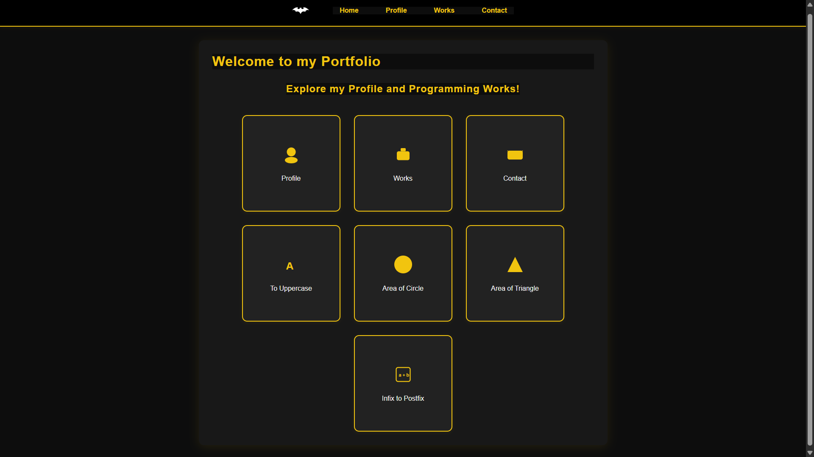
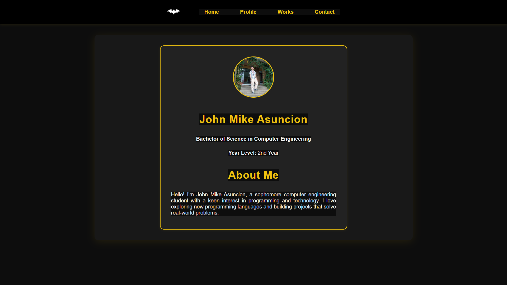
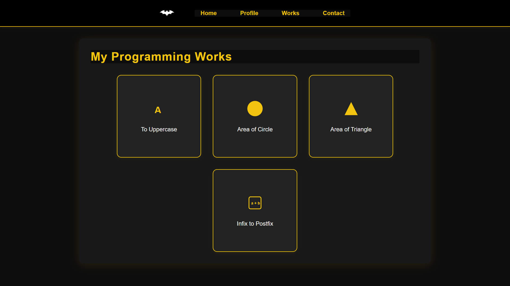
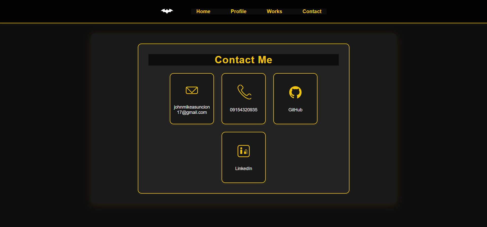

### **Course Information**

- **Course:** `CMPE 201` Data Structures and Algorithms
- **Author:** :ninja: **John Mike Asuncion** (BSCPE 2-2)
- **Professor:**  Engr. Godofredo T. Avena

## **Portfolio Directory Structure**

```
03-my_portfolio/
├── static/
│   ├── John-Mike.jpeg
│   ├── area-of-circle.png
│   ├── area-of-triangle.png
│   ├── batman-logo.png
│   ├── contact-page.png
│   ├── home-page.png
│   ├── home-page.png
│   ├── profile-page.png
│   ├── programming-works-page.png
│   ├── style.css
│   └── uppercase-converter.png
│
├── templates/
│   ├── base.html
│   ├── circle.html
│   ├── contact.html
│   ├── index.html
│   ├── infixtopostfix.html
│   ├── profile.html
│   ├── touppercase.html
│   ├── triangle.html
│   └── works.html
│
├── .gitignore
├── app.py
└── instructions.txt
```

### **Navigation Bar**


### **Home Page**


### **Profile Page**


### **Programming Works Page**



### **Contact Page**


